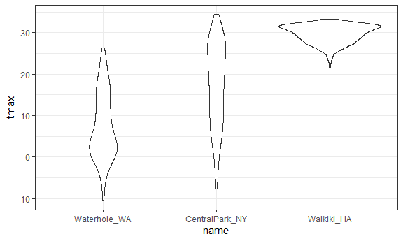

wrangling data reading data
================

``` r
library(tidyverse)
```

    ## ── Attaching packages ─────────────────────────────────────── tidyverse 1.3.2 ──
    ## ✔ ggplot2 3.3.6     ✔ purrr   0.3.4
    ## ✔ tibble  3.1.8     ✔ dplyr   1.0.9
    ## ✔ tidyr   1.2.0     ✔ stringr 1.4.0
    ## ✔ readr   2.1.2     ✔ forcats 0.5.1
    ## ── Conflicts ────────────────────────────────────────── tidyverse_conflicts() ──
    ## ✖ dplyr::filter() masks stats::filter()
    ## ✖ dplyr::lag()    masks stats::lag()

``` r
library(rvest)
```

    ## 
    ## Attaching package: 'rvest'
    ## 
    ## The following object is masked from 'package:readr':
    ## 
    ##     guess_encoding

``` r
library(httr)
```

``` r
library(tidyverse)

knitr::opts_chunk$set(
  fig.width = 6,
  fig.asp = .6,
  out.width = "90%"
)

theme_set(theme_bw() +
  theme(legend.position = "bottom"))


options(
  ggplot2.continuous.colour = "viridis",
  ggplot2.continuous.fill = "viridis"
)

scale_colour_discrete = scale_colour_viridis_d
scale_fill_discrete = scale_fill_viridis_d
```

## Scrape a table

I want the first table from [this
page](http://samhda.s3-us-gov-west-1.amazonaws.com/s3fs-public/field-uploads/2k15StateFiles/NSDUHsaeShortTermCHG2015.htm)

``` r
url = "http://samhda.s3-us-gov-west-1.amazonaws.com/s3fs-public/field-uploads/2k15StateFiles/NSDUHsaeShortTermCHG2015.htm"

drug_use_html = read_html(url)
```

extract the tables; focus on the first one

``` r
tabl_marj =
  drug_use_html %>% 
  html_nodes(css = "table") %>% 
  first() %>%
  html_table() %>% 
  slice(-1) %>% 
  as_tibble()
```

## Star Wars Movie Info

I want the data from
[here](%22https://www.imdb.com/list/ls070150896/%22)

``` r
url = "https://www.imdb.com/list/ls070150896/"

swm_html = read_html(url)
```

Grab elements that I want

``` r
title_vec = 
  swm_html %>% 
  html_nodes(css = ".lister-item-header a") %>% 
  html_text()


gross_rev_vec = 
  swm_html %>% 
  html_nodes(css = ".text-small:nth-child(7) span:nth-child(5)") %>% 
  html_text()

runtime_vec =
  swm_html %>% 
  html_nodes(css = ".runtime") %>% 
  html_text()

swm_df =
  tibble(
    title = title_vec,
    gross_rev = gross_rev_vec,
    runtime = runtime_vec)
```

## Get some water data

This is coming from an API

``` r
nyc_water =
  GET("https://data.cityofnewyork.us/resource/ia2d-e54m.csv") %>% 
  content("parsed")
```

    ## Rows: 43 Columns: 4
    ## ── Column specification ────────────────────────────────────────────────────────
    ## Delimiter: ","
    ## dbl (4): year, new_york_city_population, nyc_consumption_million_gallons_per...
    ## 
    ## ℹ Use `spec()` to retrieve the full column specification for this data.
    ## ℹ Specify the column types or set `show_col_types = FALSE` to quiet this message.

``` r
nyc_water =
  GET("https://data.cityofnewyork.us/resource/ia2d-e54m.json") %>% 
  content("text") %>% 
  jsonlite::fromJSON() %>% 
  as_tibble()
```

## BRFSS

Same process, different data

``` r
brfss_2010 =
  GET("https://chronicdata.cdc.gov/resource/acme-vg9e.csv",
      query = list("$limit" = 150000)) %>% 
  content("parsed")
```

    ## Rows: 134203 Columns: 23
    ## ── Column specification ────────────────────────────────────────────────────────
    ## Delimiter: ","
    ## chr (16): locationabbr, locationdesc, class, topic, question, response, data...
    ## dbl  (6): year, sample_size, data_value, confidence_limit_low, confidence_li...
    ## lgl  (1): locationid
    ## 
    ## ℹ Use `spec()` to retrieve the full column specification for this data.
    ## ℹ Specify the column types or set `show_col_types = FALSE` to quiet this message.

## some data arent so nice

Let’s look at Pokemon…

``` r
pokemon =
  GET("https://pokeapi.co/api/v2/pokemon/1") %>% 
  content

pokemon$name
```

    ## [1] "bulbasaur"

``` r
pokemon$height
```

    ## [1] 7

``` r
pokemon$abilities
```

    ## [[1]]
    ## [[1]]$ability
    ## [[1]]$ability$name
    ## [1] "overgrow"
    ## 
    ## [[1]]$ability$url
    ## [1] "https://pokeapi.co/api/v2/ability/65/"
    ## 
    ## 
    ## [[1]]$is_hidden
    ## [1] FALSE
    ## 
    ## [[1]]$slot
    ## [1] 1
    ## 
    ## 
    ## [[2]]
    ## [[2]]$ability
    ## [[2]]$ability$name
    ## [1] "chlorophyll"
    ## 
    ## [[2]]$ability$url
    ## [1] "https://pokeapi.co/api/v2/ability/34/"
    ## 
    ## 
    ## [[2]]$is_hidden
    ## [1] TRUE
    ## 
    ## [[2]]$slot
    ## [1] 3

``` r
weather_df = 
  rnoaa::meteo_pull_monitors(
    c("USW00094728", "USC00519397", "USS0023B17S"),
    var = c("PRCP", "TMIN", "TMAX"), 
    date_min = "2017-01-01",
    date_max = "2017-12-31") %>%
  mutate(
    name = recode(
      id, 
      USW00094728 = "CentralPark_NY", 
      USC00519397 = "Waikiki_HA",
      USS0023B17S = "Waterhole_WA"),
    tmin = tmin / 10,
    tmax = tmax / 10) %>%
  select(name, id, everything())
```

    ## Registered S3 method overwritten by 'hoardr':
    ##   method           from
    ##   print.cache_info httr

    ## using cached file: C:\Users\Admin\AppData\Local/Cache/R/noaa_ghcnd/USW00094728.dly

    ## date created (size, mb): 2022-08-14 19:27:15 (8.408)

    ## file min/max dates: 1869-01-01 / 2022-08-31

    ## using cached file: C:\Users\Admin\AppData\Local/Cache/R/noaa_ghcnd/USC00519397.dly

    ## date created (size, mb): 2022-08-14 19:27:27 (1.701)

    ## file min/max dates: 1965-01-01 / 2020-02-29

    ## using cached file: C:\Users\Admin\AppData\Local/Cache/R/noaa_ghcnd/USS0023B17S.dly

    ## date created (size, mb): 2022-08-14 19:27:33 (0.95)

    ## file min/max dates: 1999-09-01 / 2022-08-31

``` r
weather_df %>% 
  mutate(name = fct_reorder(name, tmax)) %>% 
  ggplot(aes(x = name, y = tmax)) +
  geom_violin()
```

    ## Warning: Removed 3 rows containing non-finite values (stat_ydensity).



``` r
weather_df %>% 
  lm(tmax ~ name, data = .)
```

    ## 
    ## Call:
    ## lm(formula = tmax ~ name, data = .)
    ## 
    ## Coefficients:
    ##      (Intercept)    nameWaikiki_HA  nameWaterhole_WA  
    ##           17.366            12.291            -9.884
